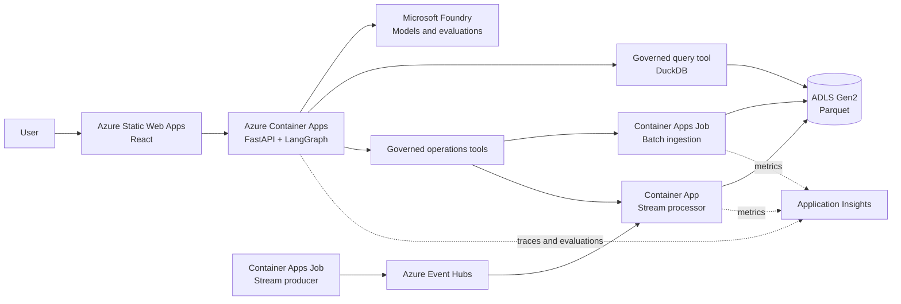

# Architecture

## Architecture overview

LakeOps Agent separates the public web application, agent service, data plane,
and pipeline workers so each component can scale and be secured according to its
workload. FastAPI and LangGraph share one deployment unit because they currently
have the same scaling, identity, and release boundary.



## Technology stack

| Layer | Technology | Current rationale |
|---|---|---|
| Web | React, TypeScript, Azure Static Web Apps | Static hosting, GitHub-oriented delivery, and no always-on frontend compute |
| API and agent runtime | FastAPI and LangGraph on Azure Container Apps Consumption | One general-purpose agent service with explicit control over transport, state, scaling, security, and observability |
| AI platform | Microsoft Foundry models and evaluation integration | Managed model access and agent quality tooling without coupling orchestration to a hosted-agent runtime |
| Query | DuckDB | Embedded analytical execution with Parquet projection and filter pushdown |
| Batch | Azure Container Apps Jobs | Scheduled, bounded, containerized execution billed only while running |
| Stream transport | Azure Event Hubs Basic | Managed event ingestion without operating a Kafka cluster |
| Stream processing | Azure Container Apps Consumption | Event-driven worker with a configurable zero or one minimum replica |
| Storage | ADLS Gen2, Hot LRS, Parquet | Low-cost immutable analytical storage and direct DuckDB access |
| Observability | OpenTelemetry and Application Insights | Correlated model, agent, tool, query, and pipeline traces |
| Infrastructure | Terraform, AzureRM, limited AzAPI | Reviewable infrastructure with an escape hatch for new Foundry capabilities |

## Deployment units

### Web application

The React application presents chat, generated SQL, query sources, pipeline
health, approval requests, and selected traces. It contains no Azure credentials.

### FastAPI agent service

The Container App validates the caller identity, owns HTTP and streaming
protocols, and runs the LangGraph workflow. The workflow owns intent routing,
schema retrieval, clarification, query planning, diagnosis, and approval
transitions. Query and operational tools remain narrow, typed, and independently
authorized.

The runtime starts at zero replicas in the public demo. Conversation state must
not depend on container memory surviving scale-to-zero. The initial version keeps
state request-scoped and accepts bounded conversation context from the client;
durable checkpoints require a separately justified store.

### Batch pipeline

Scheduled Container Apps Jobs create synthetic daily inputs, validate data,
produce partitioned Parquet, and atomically publish manifests after all output
objects are durable.

### Streaming pipeline

A producer job sends synthetic network telemetry to Event Hubs. The stream
processor consumes with checkpoints and materializes time-bounded immutable
Parquet micro-batches. The complete streaming profile is disabled by default so
Event Hubs does not create an idle fixed cost. When the profile is enabled, the
processor scales to zero between events unless continuous mode is explicitly
selected.

## Core flows

### Text-to-SQL

```text
question
  -> intent and ambiguity check
  -> relevant semantic metadata retrieval
  -> SQL generation
  -> AST and catalog validation
  -> resource policy and EXPLAIN check
  -> DuckDB execution
  -> result validation
  -> answer with SQL, sources, and execution metadata
```

The query tool registers only views described by the version-controlled dataset
catalog. Model-generated storage paths and arbitrary `read_parquet` calls are not
accepted.

### Operational action

```text
signal or user request
  -> read-only diagnosis
  -> evidence and impact
  -> deterministic action plan
  -> human approval
  -> idempotent execution
  -> postcondition verification
  -> audit record
```

### Batch and stream convergence

Both ingestion paths publish immutable bronze data. Batch transformations validate
and normalize bronze partitions into silver datasets, then compute gold business
metrics. Text-to-SQL queries only curated silver or gold views.

## Scaling and cost modes

| Mode | Streaming profile | Agent service | Intended use |
|---|---|---|---|
| Local | Local processes and fixtures | Local process | Development and tests |
| Public demo | Not provisioned | `minReplicas = 0` | Lowest-cost public portfolio deployment |
| Stream showcase | Event Hubs and workers enabled; processor scales to zero | `minReplicas = 0` | Scheduled demonstrations of the complete data path |
| Continuous stream | Enabled with processor `minReplicas = 1` | `minReplicas = 0` | Time-bounded load tests and live demonstrations |

The default Terraform environment must use Public demo mode. Streaming resources
and continuous processing must each require an explicit variable. Disabling only
the processor does not remove the fixed Event Hubs charge.

## Security boundaries

- Each deployment unit receives a separate managed identity and minimum RBAC role.
- The query identity can read only curated storage prefixes.
- Pipeline identities can write only their owned prefixes.
- Agent operation tools expose named actions rather than arbitrary Azure SDK or
  shell execution.
- Approval state is bound to an action digest so a modified plan cannot reuse an
  earlier approval.
- SQL execution has time, memory, scan, result-row, and concurrency limits.

The local filesystem threat model assumes trusted project directories. Cloud
object publication must handle normal concurrent writers without overwriting an
existing object. Resistance to a malicious actor with the same Azure identity is
provided by RBAC separation, not local path mechanics.

## Architectural constraints

- Container Apps Consumption is preferred over App Service because the system now
  includes scheduled jobs and event-driven workers in addition to an HTTP API.
- Agent hosting remains in Container Apps so the repository can demonstrate the
  state, scaling, identity, rollout, security, and observability responsibilities
  of a general-purpose agent runtime. Foundry Hosted Agent remains a documented
  migration option when managed per-session isolation and persistence outweigh
  runtime control and cost.
- Event Hubs Capture is not used in the initial design. The stream processor owns
  validation, checkpointing, and Parquet micro-batch creation.
- Event Hubs Basic uses the AMQP client interface. Kafka compatibility and the
  managed schema registry are not initial requirements.
- No table format or transactional catalog is required initially. The repository
  dataset catalog provides semantic and physical metadata for immutable Parquet.
- Production-scale distributed analytical execution is outside the initial scope;
  DuckDB is intentionally a bounded proof-of-concept query engine.
